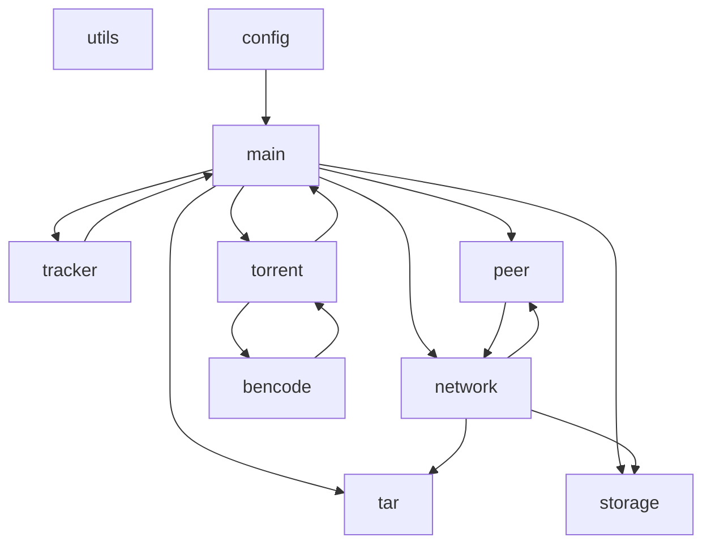

# BitTorrent клиент на C (UNIX-фильтр)

Данный проект представляет собой консольный torrent-клиент, разработанный на языке C в учебных целях. Клиент работает в стиле UNIX-фильтров: принимает torrent-файл из стандартного ввода, файла или каталога, а выводит данные либо в виде tar-архива (в stdout), либо сохраняет в файл или директорию. Программа поддерживает single-file и multi-file торренты, общается с HTTP-трекерами, загружает данные от пиров, проверяет целостность кусков по SHA1 и корректно обрабатывает сигналы и таймауты.

## Особенности

- Полноценный парсер bencode (декодирование и кодирование)
- Загрузка torrent-файлов из stdin, локального файла или каталога (режим наблюдения можно доработать)
- Поддержка single-file и multi-file торрентов
- Получение списка пиров от HTTP-трекера (libcurl)
- Установка TCP-соединений с таймаутами и повторными попытками
- Реализация протокола BitTorrent: handshake, interested, unchoke, request, piece, have, bitfield
- Загрузка кусков блоками по 16 KiB, проверка SHA1
- Сохранение данных в файл/директорию (создание вложенных папок для multi-file) или вывод tar-архива в stdout
- Обработка сигналов SIGINT/SIGTERM для graceful shutdown
- Перебор нескольких пиров, отслеживание скачанных кусков

## Требования и компиляция

### Необходимые библиотеки

- **libcurl** — для HTTP-запросов к трекеру
- **OpenSSL** (libcrypto) — для вычисления SHA1
- Стандартная библиотека C (glibc)

Установка на Debian/Ubuntu:
```bash
sudo apt install libcurl4-openssl-dev libssl-dev
```

### Компиляция

Используется Makefile. Просто выполните в корне проекта:
```bash
make
```


Бинарный файл torrent_client будет создан в текущей директории.


Очистка объектных файлов:
```bash
make clean
```
Сборка с сантиайзером (для отладки и тестирования)
```bash
make sanitize
```

## Использование

### Формат командной строки
```bash
torrent_client [-f file.torrent | -d directory] [-o file | -O directory]
-f file.torrent — загрузить торрент из указанного файла.

-d directory — следить за директорией и автоматически обрабатывать новые .torrent файлы (в текущей версии не реализовано).

-o file — сохранить загруженные данные в один файл (только для single-file торрентов).

-O directory — извлечь файлы в указанную директорию (для multi-file создаются поддиректории).
```
Если ни один из ключей ввода не указан, торрент читается из stdin.

Если ни один из ключей вывода не указан, в stdout выводится tar-архив.

### Примеры

Загрузить торрент из файла и сохранить содержимое в текущую директорию (multi-file):
```bash
./torrent_client -f ubuntu.torrent -O ./download
```

Загрузить торрент из stdin и вывести tar-архив в stdout (можно передать в tar):
```bash
curl -s http://example.com/file.torrent | ./torrent_client | tar xvf -
```

Сохранить single-file торрент в конкретный файл:
```bash
./torrent_client -f debian.torrent -o debian.iso
```

Загрузить торрент из файла, но не указывать вывод — будет создан tar в stdout:
```bash
./torrent_client -f archlinux.torrent > arch.tar
```

## Формат bencode
Bencode (BitTorrent encoding) — простой формат сериализации данных, используемый в .torrent файлах и при общении с трекером. Поддерживаются четыре типа:

* Строка: <длина>:<данные>
Пример: 4:spam → "spam"

* Целое число: i<число>e
Пример: i42e → 42

* Список: l<bencoded значения>e
Пример: l4:spami42ee → ["spam", 42]

* Словарь: d<ключ1><значение1><ключ2><значение2>e
Пример: d4:name5:alice3:agei30ee → {"name": "alice", "age": 30}

Ключи словаря — строки. Все данные хранятся в точном бинарном виде, строки не обязательно содержат текст.

В проекте реализованы функции bencode_decode для разбора и bencode_encode для сериализации.

## Как работает BitTorrent (упрощённо)
Метаданные — torrent-файл содержит announce URL трекера и словарь info с именем файла, размером куска (piece length), списком SHA1-хешей кусков и для multi-file — списком файлов с путями.

1. Трекер — клиент отправляет HTTP GET запрос к announce-серверу с параметрами: info_hash, peer_id, port, uploaded, downloaded, left, compact=1. Трекер возвращает список пиров (IP и порт) в компактном формате (6 байт на пира: 4 байта IP + 2 байта порт).

2. Handshake — клиент устанавливает TCP-соединение с пиром и отправляет рукопожатие: длина протокола (19), строка "BitTorrent protocol", 8 зарезервированных байт, info_hash (20 байт), peer_id (20 байт). Пир отвечает аналогично.

3. Обмен сообщениями — после handshake пир может прислать битовое поле (bitfield) — битовую маску имеющихся у него кусков. Клиент отправляет interested (ID 2) и ждёт unchoke (ID 1). После этого можно запрашивать куски.

4. Запрос кусков — кусок запрашивается блоками (обычно 16 KiB) с помощью сообщения request (ID 6), содержащего индекс куска, смещение и длину. Пир отвечает сообщением piece (ID 7) с данными.

5. Проверка целостности — после получения полного куска вычисляется его SHA1 и сравнивается с хешем из torrent-файла. Если не совпадает — кусок скачивается заново.

6. Завершение — когда все куски скачаны, клиент может оповестить трекер (не реализовано) и завершить работу.

## Архитектура приложения
Проект разбит на логические модули, каждый из которых отвечает за строго определённую задачу. Взаимодействие между модулями показано на диаграмме ниже.

#### Список модулей
|Модуль	|Файлы	        |Ответственность|
|-------|-------        |---------------|
|config	|config.h/c	|Разбор аргументов командной строки, формирование структуры config_t|
|utils	|utils.h/c	|Общие утилиты: безопасное выделение памяти, логирование, сигналы, чтение stdin, URL-кодирование, генерация peer_id|
|bencode|bencode.h/c	|Парсинг и сериализация bencode|
|torrent|torrent.h/c	|Загрузка .torrent файла, извлечение метаданных (info_hash, список файлов, куски)|
|tracker|tracker.h/c	|Общение с HTTP-трекером (libcurl), получение списка пиров|
|network|network.h/c	|Низкоуровневая работа с сокетами с таймаутами (connect, send, recv)|
|peer	|peer.h/c	|Реализация протокола BitTorrent: handshake, отправка/приём сообщений, управление битовым полем, загрузка блоков|
|storage|storage.h/c	|Сохранение данных в файлы/директории (создание поддиректорий, запись фрагментов)|
|tar	|tar.h/c	|Формирование tar-архива на лету для вывода в stdout|
|main	|main.c	        |Координация всех модулей: инициализация, цикл по пирам, загрузка кусков, обработка сигналов|

#### Взаимодействие модулей

